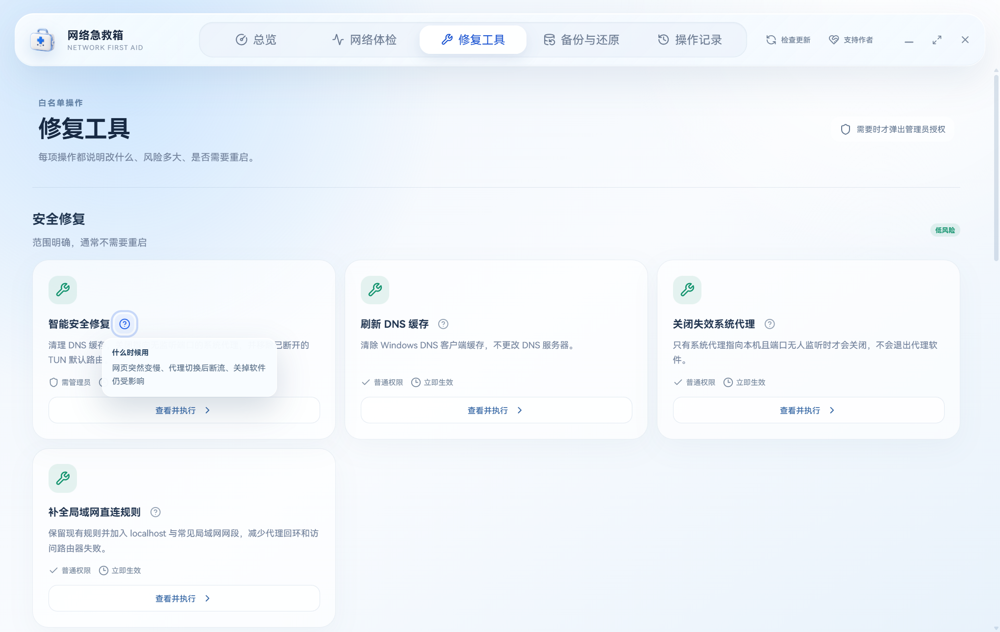
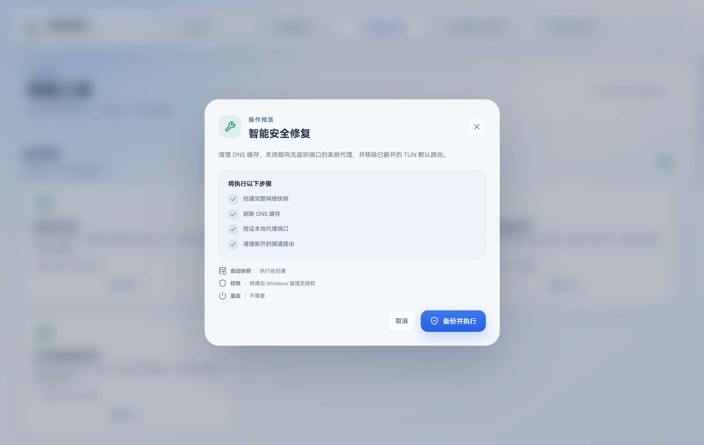

<p align="center">
  
</p>

<h1 align="center">网络急救箱</h1>

<p align="center">
  <strong>看清是谁接管了 Windows 网络，再安全地修复代理、TUN、DNS 与路由冲突。</strong><br />
  一键体检 · 白名单修复 · 自动备份 · 选择性回滚
</p>

<p align="center">
  <a href="https://github.com/soberbw-hash/network-first-aid/releases/latest"></a>
  <a href="https://github.com/soberbw-hash/network-first-aid/actions/workflows/ci.yml"></a>
  
  
  <a href="LICENSE"></a>
</p>

<p align="center">
  <a href="#download">下载</a> ·
  <a href="#about">适用场景</a> ·
  <a href="#features">功能</a> ·
  <a href="#safety">安全与回滚</a> ·
  <a href="#development">开发</a> ·
  <a href="#license">许可</a>
</p>


> [!IMPORTANT]
> 本工具会读取并在你确认后修改 Windows 网络配置。公司网络、远程服务器、专线、VPN 或定制防火墙环境可能有额外策略；执行高风险修复前，请确保拥有管理员授权和备用联网方式。

## 📌 项目状态

- 当前正式版：`v0.1.1`。
- 支持平台：Windows 10 / 11 x64。
- 桌面架构：Tauri 2 + Rust + React + TypeScript。
- 数据策略：诊断、快照与操作日志默认只留在当前电脑，不提供账号、云同步或遥测。
- 发布方式：安装版与便携版均通过本仓库 [Releases](https://github.com/soberbw-hash/network-first-aid/releases/latest) 提供。

<a id="about"></a>

## 网络急救箱是什么？

当 Clash、Mihomo、XSUS、sing-box、WireGuard 等工具先后接管过网络，Windows 可能同时残留系统代理、WinHTTP 代理、TUN 默认路由、虚拟网卡和自定义 DNS。它们单独看似正常，组合后却会互相打架。

典型表现包括：

- 不开代理时并非完全断网，但任何网页都加载很慢；
- 同一节点在手机正常，电脑却频繁 `timeout`；
- “系统代理”和“TUN 模式”有时必须同时开，有时同时开反而断网；
- 本地代理端口存在，但浏览器、Codex 或 ChatGPT 仍不断重连；
- 关闭代理软件后，系统代理、DNS 或虚拟路由没有恢复；
- 重置网络能短暂恢复，但不知道究竟改了什么，也无法安全回退。

网络急救箱不会把所有问题都归咎于“节点不行”。它把本地端口、代理出口、DNS、网卡、路由和进程拆开验证，再根据可观察证据给出对应建议。

## 为什么 Windows 网络问题总是这么难查？

很多网络故障并不是“某个设置错了”，而是多个接管层同时存在：浏览器读取系统代理，命令行工具可能读取 WinHTTP，TUN 改写默认路由，虚拟网卡又带来自己的 DNS；退出某个客户端，只能停止进程，未必会把所有系统状态恢复。

于是就会出现最折磨人的情况：

- 同一个节点在手机正常，在电脑却超时；
- 浏览器能开网页，开发工具却连不上；
- 系统代理关了，WinHTTP 仍然指向旧端口；
- TUN 已退出，默认路由或 DNS 还指向虚拟网卡；
- 重启后暂时恢复，下一次切换模式又复发。

网络急救箱的价值不是“多放几个重置按钮”，而是把这些接管层放在同一份证据里看，让修复动作有明确理由。

## 核心设计原则

### 🩺 先诊断，再修复

默认入口是只读体检。软件先回答端口、出口、DNS、路由、网卡和进程各自是否正常，再决定是否需要写系统配置。

### 🧩 把冲突拆成独立层

“网络不通”不会被压成一个红灯。直连、代理、本地监听、WinHTTP、系统代理、TUN、DNS 和默认路由分别显示，避免用一个模糊结论掩盖不同根因。

### 🛟 所有写操作都要留退路

需要改代理、DNS、Hosts 或防火墙时，先生成结构化快照。恢复时也按类别选择，不为了修一个 DNS 把全部网络配置一起覆盖。

### 🧱 不接受任意命令

桌面界面只能提交程序预置的动作 ID，不能把任意 PowerShell 字符串交给高权限进程执行。新增修复项必须在源码中明确实现、说明和审查。

### 🗣️ 用人话解释系统术语

每个动作都要回答“什么现象下使用”“会改变什么”“什么时候不要用”，而不是只展示 `Winsock`、`netsh` 或 `netcfg` 名称。

## 它不是什么

- 不是代理客户端，不提供节点、订阅或代理服务；
- 不是网络加速器，不承诺提升带宽或降低游戏延迟；
- 不绕过单位、校园或地区网络策略；
- 不会在后台持续接管 DNS、代理或防火墙；
- 不会未经确认执行全量网络重置。

<a id="features"></a>

## ✨ 功能一览

| 能力         | 检查或处理的内容                                                               | 设计原则                           |
| ------------ | ------------------------------------------------------------------------------ | ---------------------------------- |
| 网络体检     | 网卡、DNS、系统代理、WinHTTP、默认路由、TUN、监听端口、Hosts、相关进程和服务   | 先只读，后建议                     |
| 代理专项诊断 | localhost 代理是否监听、代理出口是否可用、多代理是否冲突、TUN 路由是否残留     | 区分“本地端口可用”和“外网真的可达” |
| 白名单修复   | DNS、DHCP、WinHTTP、局域网绕过、网卡、Winsock、TCP/IP、Hosts、防火墙和网络组件 | 只允许预置动作 ID，不接受任意命令  |
| 自动快照     | 修复前记录代理、DNS、Hosts、防火墙等状态                                       | 写入前留退路                       |
| 选择性还原   | 分别恢复代理、DNS、Hosts 或防火墙                                              | 不强迫用户一刀切                   |
| 更新检查     | 主动读取本仓库最新正式 Release                                                 | 不后台静默替换程序                 |
| 本机审计     | 记录检测、备份、修复、失败和还原结果                                           | 不上传网络配置                     |

界面中每项修复都带有普通话场景说明，重点回答“什么时候该用”和“会改什么”，不要求用户先理解 Winsock、WinHTTP 或默认路由。

### 🩺 1. 一键网络体检

集中读取网卡、DNS、系统代理、WinHTTP、默认路由、TUN、监听端口、Hosts、常见代理进程和服务，再把原始状态转换成能直接行动的结论。

### 🔌 2. 本地代理端口检查

判断配置中的 localhost 端口是否真的有人监听。端口未监听时，继续切换浏览器或节点没有意义，应先恢复客户端或清理失效代理。

### 🌍 3. 直连与代理出口分开验证

本地端口存在只能说明程序启动了，不能说明上游节点可用。软件分别验证直连和代理出口，帮助区分“电脑配置坏了”和“代理出口失败”。

### 🧭 4. TUN、网卡与默认路由分析

把活动网卡、虚拟网卡和默认路由放在同一视图中，识别已退出 TUN 留下的路由、多个虚拟网卡竞争或实际出口与预期不一致。

### 🧠 5. 证据驱动的建议

诊断不会因为发现代理进程就自动建议重置。建议必须与可观察异常对应，例如失效本地端口、异常 DNS、残留代理或断开的 TUN 路由。

### 🧰 6. 15 项白名单修复

修复覆盖 DNS、DHCP、WinHTTP、局域网绕过、网卡、Winsock、TCP/IP、Hosts、防火墙和网络组件。每个动作都有独立说明、风险级别和执行结果。

### 💾 7. 修复前自动备份

任何写操作前保存当前关键状态。高风险动作如果无法完成备份，就不应继续假装“安全修复”。

### ↩️ 8. 选择性还原

代理、DNS、Hosts 和防火墙可以分别恢复。用户能针对实际受影响的部分回退，减少新的连锁问题。

### 📋 9. 本机操作记录

体检、备份、修复、失败和恢复会形成可回看的本机记录，便于判断哪一步改变了结果，也便于提交脱敏后的 Issue。

### 🔔 10. 主动更新检查

只在用户点击时读取 GitHub Release，显示当前版本和最新版本；不在后台静默覆盖便携版或修改系统配置。

## 🎯 一次体检回答三个问题

1. **谁在接管网络？** 系统代理、WinHTTP、TUN 网卡、默认路由和常见代理进程一屏查看。
2. **为什么会超时？** 区分本地代理未监听、代理出口失败、DNS 异常、虚拟路由残留或多代理冲突。
3. **修复后能不能回去？** 写操作前创建结构化快照，支持按类别恢复关键设置。

<a id="download"></a>

## 📥 下载与开始使用

前往 [Releases](https://github.com/soberbw-hash/network-first-aid/releases/latest) 下载：

- `Network-First-Aid-Setup-*.exe`：安装版，可创建开始菜单和桌面入口；
- `Network-First-Aid-Portable-*.exe`：免安装便携版，适合先试用或随身维护。

建议流程：

1. 只从本仓库 Release 下载，并核对 Release 提供的 SHA-256；
2. 第一次打开先运行“网络体检”，不要直接做高风险重置；
3. 根据异常项阅读对应修复说明；
4. 确认自动快照已成功创建后再执行写操作；
5. 修复后重新体检，并分别测试直连和代理访问；
6. 若结果变差，进入还原页选择受影响的配置类别回滚。

软件暂未购买商业代码签名，Windows SmartScreen 可能显示“未知发布者”。这不等于文件一定有问题，但应确保下载来源和校验值正确。

## 🚀 3 分钟开始使用

### 第 1 分钟：保持现场

先不要连续重启代理软件、切换 TUN 或执行系统重置。保持故障现场，打开网络急救箱，让体检看到真实冲突。

### 第 2 分钟：看懂结论

优先看四项：本地代理端口、直连结果、代理出口、默认路由/DNS。绿色不代表全部正常，红色也不代表需要最重的修复；阅读结论旁的场景说明。

### 第 3 分钟：做最小修复

只执行与证据直接相关的最小动作。修复后重新体检并复测原来失败的软件；如果结果变差，立即使用刚生成的快照恢复对应类别。

> [!TIP]
> 第一次使用时，可以在网络正常的状态下先做一次体检，熟悉自己的正常网卡、DNS、代理和路由长什么样。真正出问题时会更容易判断差异。

## 🧰 修复范围与风险分层

| 层级     | 示例                                 | 适合什么时候               | 主要风险                 |
| -------- | ------------------------------------ | -------------------------- | ------------------------ |
| 只读     | 重新体检、端口/出口检查              | 任何时候                   | 不写配置                 |
| 低风险   | 清理失效系统代理、恢复自动 DNS/DHCP  | 证据明确且目标单一         | 可能改变当前代理使用方式 |
| 中风险   | 重启网卡、刷新网络状态、重置 WinHTTP | 常规修复无效               | 短暂断网、应用需要重连   |
| 高风险   | Winsock/TCP-IP、防火墙相关恢复       | 多项证据指向系统栈异常     | 需要管理员权限和重启     |
| 最后手段 | `netcfg -d` 重装网络组件             | 其它方案均失败且有备用连接 | 虚拟网卡/VPN 需重新安装  |

> [!CAUTION]
> 远程控制中的电脑不要轻易执行会禁用网卡、重置网络栈或重装网络组件的动作，否则可能立刻失去连接，并且无法远程完成恢复。

## 🧭 常见场景

### 关闭代理后网络仍然很慢

先检查系统代理和 WinHTTP 是否仍指向已经停止监听的本地端口，再检查 DNS 和默认路由。不要一开始就重置整个网络栈。

### TUN 开启后部分软件正常、部分软件超时

重点查看 TUN 网卡、默认路由优先级、DNS 去向和是否同时存在另一个代理进程。体检会把这些证据放在同一页中，便于判断冲突组合。

### 本地代理端口正常但外网不可达

这说明“客户端在监听”不等于“代理出口正常”。应分别测试直连和经代理访问，检查节点、上游连接或代理规则，而不是继续修复本地端口。

### 多个代理客户端轮流使用

先退出不需要的客户端，再检查残留系统代理、服务和虚拟网卡。避免在两个客户端同时运行时反复覆盖同一组设置。

### 浏览器正常，但 Git、终端或开发工具不通

浏览器可能使用系统代理，而 Git、包管理器或服务进程可能读取 WinHTTP、环境变量或自己的配置。先比较系统代理与 WinHTTP，再检查工具是否写死了旧端口。

### DNS 看起来正常，但域名偶发解析失败

确认活动网卡实际使用的 DNS，而不是只看某个已经断开的适配器。TUN、VPN、公司安全软件和虚拟网卡可能同时设置 DNS；修复后要测试多个域名，不能只看一个缓存结果。

### 修复后能上网，但代理软件启动就再次出错

说明代理客户端启动时重新写回了某些设置。应检查客户端规则、启动模式和 TUN 配置，而不是反复用急救箱覆盖；急救箱负责帮助定位，不代替代理客户端本身的配置管理。

<a id="safety"></a>

## 🛡️ 安全修复工作流

网络急救箱把动作按影响范围区分，并对危险操作增加额外门槛：

- **只读检测**：收集状态并生成分析，不写系统配置；
- **低风险修复**：只调整明确目标，例如清理失效代理或恢复 DHCP/DNS；
- **需要管理员权限的修复**：仅在动作确实涉及系统级配置时触发 UAC；
- **高风险修复**：必须二次确认，并在执行前强制创建完整快照；
- **最后手段**：`netcfg -d` 只存在于“彻底重装网络组件”，会影响虚拟网卡和网络组件，不应作为日常第一选择。

关键安全边界：

- Renderer 不能提交 PowerShell 文本或任意命令，只能选择编译进程序的固定动作 ID；
- “智能安全修复”不会关闭正在工作的 TUN，不会默认重置防火墙或整个网络栈；
- 执行结果、耗时、输出摘要和失败原因会记录到本机审计日志；
- 还原支持按代理、DNS、Hosts、防火墙拆分，减少无关配置被覆盖的概率。

## 🔒 隐私与数据边界

- 不需要注册账号；
- 不收集分析数据，不接入广告或遥测 SDK；
- 诊断会读取本机网络相关状态，但不会主动上传；
- 快照和操作记录保存在本机；
- 更新检查仅在用户主动触发时访问 GitHub Release；
- 提交 Issue 前请删除节点地址、订阅链接、公司域名、设备名、账号和其它敏感信息。

## 🖼️ 界面预览

| 总览与体检                  | 修复场景说明                      |
| --------------------------- | --------------------------------- |
|  |  |

| 修复前确认                           | 更新检查                           |
| ------------------------------------ | ---------------------------------- |
|  |  |


界面使用 HarmonyOS Sans，并尊重 Windows 的“减少动态效果”设置。字体许可见 `assets/HarmonyOS-Sans-LICENSE.txt`。

## 🏗️ 它是怎么工作的？

```text
React / TypeScript Renderer
        │  仅提交固定动作 ID 和结构化参数
        ▼
Tauri IPC 边界
        │
        ▼
Rust 核心
  ├─ 诊断与证据分析
  ├─ 快照、审计与还原
  ├─ 权限和动作调度
  └─ 调用内置 PowerShell 资源
        │
        ▼
Windows 网络组件、注册表与系统命令
```

主要技术：Tauri 2、Rust、React、TypeScript、Vite、PowerShell 与 WebView2。

### 诊断层

Rust 读取结构化系统状态，并调用固定资源脚本获取 Windows 网络证据。诊断分析位于共享 TypeScript 模块中，便于用测试样例验证“什么证据应该得到什么建议”。

### 执行层

修复动作由编译进程序的目录管理。Renderer 只传动作 ID，Rust 负责权限、备份、进程执行、输出解析和错误归一化。

### 持久化层

快照和审计记录与界面状态分离。恢复逻辑读取结构化备份，不依赖用户记住修复前的原始值。

### 更新层

更新检查只读取 GitHub Release 元数据并打开下载页。便携版不会在后台被替换，避免网络工具在运行中自我覆盖。

<a id="development"></a>

## 🛠️ 从源码开发

### 环境要求

- Windows 10 / 11；
- Node.js 22+ 与 Corepack；
- Rust `1.96.1`（仓库由 `rust-toolchain.toml` 固定）；
- Visual Studio 2022 C++ Build Tools；
- WebView2 Runtime（现代 Windows 10/11 通常已安装）。

### 安装与启动

```powershell
git clone https://github.com/soberbw-hash/network-first-aid.git
cd network-first-aid
corepack enable
corepack pnpm install
corepack pnpm dev
```

### 验证

```powershell
corepack pnpm typecheck
corepack pnpm test
corepack pnpm build
cargo test --manifest-path src-tauri/Cargo.toml
```

### Windows 打包

```powershell
corepack pnpm dist:win
```

安装包和便携版输出到 `release/`。涉及系统配置的改动应至少验证：普通权限、管理员权限、快照失败、动作失败、还原成功和多网卡/TUN 环境。

## 📁 项目结构

```text
src/renderer/                 React 桌面界面
src/shared/                   动作目录、类型契约、诊断分析与更新策略
src-tauri/src/                Rust 诊断、修复、快照、审计和更新逻辑
src-tauri/resources/          随程序打包的固定 PowerShell 资源
tests/                        诊断、安全与更新策略测试
docs/                         截图、发布说明与设计资料
scripts/package-windows.ps1   Windows 打包入口
```

## ❓ 常见问题

### 网络急救箱会不会自己接管网络？

不会。它不是常驻代理或 VPN，不提供节点，也不会为了诊断持续驻留并改写路由。写操作只在用户明确选择修复后执行。

### 为什么不直接提供“万能修复”？

网络环境差异太大。全量重置可能暂时解决一个问题，却删除 VPN、虚拟网卡、公司策略或自定义 DNS。项目优先最小修复和选择性恢复。

### 体检会把节点或订阅上传吗？

不会。诊断在本机完成，项目没有上传网络配置的后端。提交 Issue 时仍要由用户主动脱敏附件。

### 不用代理时也能使用吗？

可以。DNS、网卡、DHCP、路由和系统栈问题与代理无关，只是代理/TUN 冲突是项目重点场景。

### 公司电脑可以直接修吗？

不建议未经管理员确认。公司 VPN、EDR、防火墙和 DNS 可能由策略强制下发，手工恢复会违反组织要求或很快被重新覆盖。

### 为什么修复需要 UAC？

修改系统级网络、注册表、防火墙或网络组件需要管理员权限。只读体检和部分低风险动作不应无理由提权。

### 快照是不是完整系统备份？

不是。它只覆盖本工具声明的关键网络配置，不能代替还原点、镜像或企业备份。

### 远程服务器能用吗？

技术上可能运行，但高风险动作会断开远程连接。没有带外管理或现场人员时，不应在唯一远程通道上尝试网络栈重置。

### 支持 macOS 或 Linux 吗？

当前不支持。诊断、修复和界面都围绕 Windows 10/11 的网卡、注册表、PowerShell 和系统组件设计。

### 修复成功但某个软件仍不能联网怎么办？

检查该软件自己的代理、证书、环境变量、账号和防火墙规则。系统网络正常不代表应用级配置一定正常。

### 可以修改或重新分发吗？

不可以默认这样做。本项目是源码可见专有软件，查看源码不等于获得复制、修改、重新打包或商用许可，具体见 [LICENSE](LICENSE)。

## 🤝 反馈与参与

提交 Issue 时建议包含：

- 网络急救箱版本与 Windows 版本；
- 使用的代理软件及版本；
- 是否开启系统代理、TUN、VPN 或虚拟网卡；
- 可复现步骤和预期/实际结果；
- 已脱敏的体检摘要、操作记录和错误截图。

不要公开上传订阅地址、节点凭据、内部域名、完整 Hosts、公司 VPN 配置或带用户名的本机路径。安全问题请优先阅读 [SECURITY.md](SECURITY.md)。

欢迎提交：

- 能稳定复现的代理/TUN/DNS 冲突；
- 特定 Windows 版本、网卡或代理客户端兼容问题；
- 诊断结论与实际证据不一致的样例；
- 修复说明不够清楚或风险提示不足；
- 不增加任意命令执行面的白名单修复建议。

涉及新系统动作的 Pull Request 必须说明读取/写入范围、管理员权限、备份内容、失败行为、恢复方式和测试环境。

## 📚 版本记录

- **v0.1.1**：当前正式版，完善诊断、修复、安全测试和 Windows 发布流程；
- **v0.1.0**：首个公开版本，建立代理/TUN/DNS 冲突体检、白名单修复、快照和还原基础。

详细变化见 [CHANGELOG.md](CHANGELOG.md) 与 `docs/release-*.md`。

<a id="license"></a>

## ⚖️ 许可与第三方组件

本仓库为**源码可见的专有软件**，不是开放源代码软件。除第三方组件外，网络急救箱的源代码、界面、文档、品牌和构建资源均保留全部权利。普通用户可以按照 [LICENSE](LICENSE) 运行作者发布的未修改正式版本；未经书面许可，不得复制源码、制作和分发修改版、转售、托管为服务或用于商业产品。

完整条款见 [LICENSE](LICENSE)。第三方代码、字体、图标、系统组件和通过组件中心安装的软件继续适用各自许可证或服务条款，详见 [THIRD_PARTY_NOTICES.md](THIRD_PARTY_NOTICES.md)。

> 许可证可以约束代码、文档和品牌的使用，但不会自动垄断抽象的软件想法、通用功能或工作流程。需要商业合作、分发或二次开发授权时，请先取得版权所有者的书面许可。
